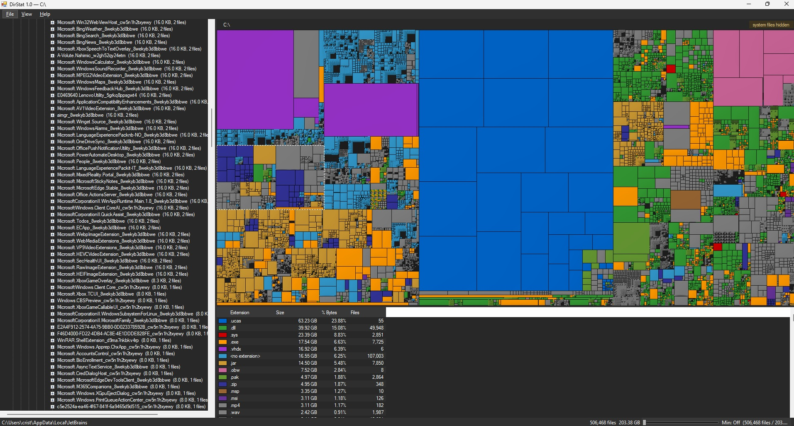

# DirStat

A WinDirStat-inspired disk usage analyzer for Windows, built to handle modern multi-TB drives. Single-file ~44 KB executable, no installer, no runtime download.




## Download

See the [Releases page](https://github.com/crsadun/DirStat/releases) for all
versions. The latest build is always at
[releases/latest/download/DirStat.exe](https://github.com/crsadun/DirStat/releases/latest/download/DirStat.exe).

## Run

```
DirStat.exe
DirStat.exe "C:\some\path"
```

## Features

- Parallel filesystem scan with squarified treemap and cushion shading
- Top-12 extension color map; click an extension in the legend to highlight matching cells in the treemap
- Tree ↔ treemap selection sync, lazy tree expansion for huge trees
- File menu: Open Folder, Open Drive (with sizes & free space), Up One Level (Alt+Up), Refresh (F5), Stop
- Right-click context menu on tree and treemap:
  - Refresh / Refresh parent directory
  - Open in Explorer / Command Prompt / PowerShell
  - Show in Explorer / Open containing folder
  - Delete (Del, recycle bin) / Delete permanently (Shift+Del) — both with confirmation
  - Copy path
- Dark theme

## Author

[Cristiano Sadun (@crsadun)](https://github.com/crsadun), using Claude
